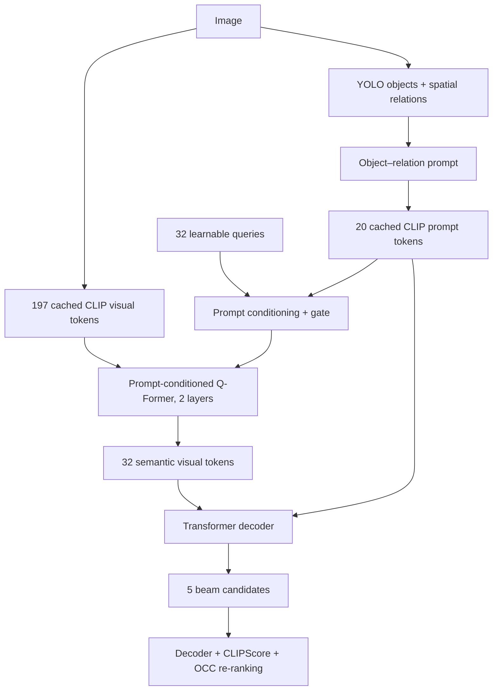

# Prompt-Conditioned Q-Former và re-ranking đa điểm

## Mục tiêu

Q-Former cũ dùng cùng 32 learnable queries cho mọi ảnh. Phiên bản mới dùng semantic
prompt để điều kiện hóa từng query trước khi query cross-attend 197 CLIP visual
tokens. Đây là thí nghiệm chính để kiểm tra object–relation prompt có thực sự điều
khiển quá trình truy vấn ảnh hay không.



Với masked mean prompt `p` và learnable query `q_i`:

```text
condition = Wp(p)
g_i = sigmoid(Wg([q_i; condition]))
q_i' = LayerNorm(q_i + g_i * condition)
```

`q_i'` mới được đưa vào các Q-Former layers để truy vấn visual tokens. Gate khởi
đầu với `sigmoid(-2) ≈ 0,119`, tránh để prompt lấn át query ngay từ đầu.

## Thí nghiệm cần chạy trước

Chỉ chạy validation. Không mở test cho tới khi đã chọn:

- có giữ prompt conditioning hay không;
- trọng số decoder/CLIPScore/OCC tốt nhất trên validation.

Gắn các Kaggle Input hiện có:

- MS COCO 2014, `dataset_coco.json` và images;
- prompt cache object–relation;
- ba visual-cache shards;
- `objectdetectioncache.json`.

## Cell Kaggle đầy đủ

Chạy `SMOKE=True` trước. Nếu hoàn tất 20 batch, đổi thành `False` và Save Version.
Bản full train 10 epoch, sinh candidates cho validation, tính CLIPScore và tune
re-ranking. Không chạy test.

```python
import json
import os
import subprocess
import sys
from pathlib import Path

import torch

REPO = Path('/kaggle/working/Image_Captioning')
COMMIT = 'badda5a'

COCO_JSON = Path('/kaggle/input/datasets/vuthetam/mscoco-2014/dataset_coco.json')
COCO_IMAGES = Path('/kaggle/input/datasets/vuthetam/mscoco-2014/images')
PROMPT_CACHE = Path(
    '/kaggle/input/datasets/ducanh2403/prompt-cache/prompt_clip_tokens_cache.pt'
)
VISUAL_CACHE = Path('/kaggle/input/datasets/ducanh2403/visual-cache')
DETECTIONS = Path(
    '/kaggle/input/datasets/ducanh2403/'
    'objectdetectionecache/objectdetectioncache.json'
)

SMOKE = True  # Thành công 20 batch thì đổi thành False.
EPOCHS = 1 if SMOKE else 10
EXPERIMENT = (
    'prompt_conditioned_qformer_smoke'
    if SMOKE else 'prompt_conditioned_qformer_32q_2l'
)


def run(args, cwd=None):
    args = list(map(str, args))
    print('\nRunning:', ' '.join(args), flush=True)
    subprocess.run(args, cwd=cwd, check=True)


# 1. Kiểm tra GPU và Input.
print('PyTorch:', torch.__version__)
print('CUDA devices:', torch.cuda.device_count())
for index in range(torch.cuda.device_count()):
    print(f'GPU {index}:', torch.cuda.get_device_name(index))
assert torch.cuda.device_count() == 2, 'Notebook phải chọn GPU T4 x2.'

for path in (COCO_JSON, PROMPT_CACHE, DETECTIONS):
    assert path.is_file(), f'Thiếu Input: {path}'
assert COCO_IMAGES.is_dir(), COCO_IMAGES
for part in range(1, 4):
    shard = VISUAL_CACHE / f'visual_part_{part:02d}_of_03.h5'
    assert shard.is_file(), f'Thiếu visual cache: {shard}'


# 2. Clone đúng phiên bản code.
if not REPO.exists():
    run([
        'git', 'clone',
        'https://github.com/Supzxjee/Image_Captioning.git',
        REPO,
    ])
os.chdir(REPO)
run(['git', 'fetch', 'origin'])
run(['git', 'checkout', '--detach', COMMIT])
run(['git', 'rev-parse', '--short', 'HEAD'])
run([sys.executable, '-m', 'pip', 'install', '-q', '-r', 'requirements.txt'])


# 3. Cấu hình Prompt-Conditioned Q-Former.
common = [
    '--dataset-json-path', COCO_JSON,
    '--base-path', COCO_IMAGES,
    '--prompt-cache-path', PROMPT_CACHE,
    '--visual-cache', VISUAL_CACHE,
    '--visual-cache-id-key', 'coco_id',
    '--visual-preprocessing', 'bilinear',
    '--visual-precision', 'fp32',
    '--visual-adapter', 'qformer',
    '--num-visual-queries', '32',
    '--qformer-layers', '2',
    '--prompt-conditioned-qformer',
    '--experiment-name', EXPERIMENT,
]

train_args = [
    'train_h1_2_gated.py',
    '--mode', 'train',
    '--epochs', EPOCHS,
    '--seed', '42',
    '--batch-size', '32',
    '--num-workers', '0',
] + common
if SMOKE:
    train_args += ['--max-train-batches', '20']


# 4. Train global batch 32 = 16 ảnh/GPU.
run([
    sys.executable, '-m', 'accelerate.commands.launch',
    '--multi_gpu',
    '--num_processes', '2',
    '--num_machines', '1',
    '--mixed_precision', 'no',
    '--dynamo_backend', 'no',
    '--num_cpu_threads_per_process', '1',
] + train_args)


# 5. Kiểm tra checkpoint để không đánh giá nhầm Q-Former cũ/ITC/region.
experiment_dir = Path('/kaggle/working') / EXPERIMENT
history_path = experiment_dir / 'train_history_h1_2.json'
checkpoint = (
    experiment_dir /
    f'checkpoints/model_h1_2_crossattn_epoch_{EPOCHS}.pth'
)
assert history_path.is_file(), history_path
assert checkpoint.is_file(), checkpoint
metadata = torch.load(checkpoint, map_location='cpu', weights_only=False)
assert metadata['visual_adapter'] == 'qformer'
assert metadata['num_visual_queries'] == 32
assert metadata['qformer_layers'] == 2
assert metadata['prompt_conditioned_qformer'] is True
assert float(metadata['alignment_weight']) == 0.0
assert float(metadata['itc_weight']) == 0.0
assert metadata['max_train_batches'] == (20 if SMOKE else 0)
print('\nHistory:', history_path.read_text(encoding='utf-8'))
print('Checkpoint PASS: Prompt-Conditioned Q-Former 32q, 2 layers.')
del metadata


# 6. Bản full: sinh 5 candidates trên validation.
if not SMOKE:
    run([
        sys.executable, '-u', 'train_h1_2_gated.py',
        '--mode', 'candidates',
        '--checkpoint', checkpoint,
        '--split', 'val',
        '--limit', '0',
        '--candidate-count', '5',
        '--batch-size', '32',
        '--num-workers', '0',
    ] + common)

    evaluation_dir = experiment_dir / 'evaluation'
    candidates = evaluation_dir / 'val_5000_beam5_candidates.json'
    ground_truth = evaluation_dir / 'val_5000_gt_candidates.json'
    assert candidates.is_file(), candidates
    assert ground_truth.is_file(), ground_truth

    candidate_bundle = json.loads(candidates.read_text(encoding='utf-8'))
    assert candidate_bundle['metadata']['count'] == 5000
    assert candidate_bundle['metadata']['prompt_conditioned_qformer'] is True


    # 7. Tính CLIPScore cho mọi beam candidate từ visual cache.
    # Không đọc lại 5.000 ảnh: dùng CLS token đã cache, rồi áp dụng đúng
    # CLIP post-layernorm và visual projection.
    scored_candidates = evaluation_dir / 'val_5000_beam5_clipscore_candidates.json'
    run([
        sys.executable, '-u', 'score_clip_candidates.py',
        '--candidates', candidates,
        '--visual-cache', VISUAL_CACHE,
        '--output', scored_candidates,
        '--model', 'openai/clip-vit-base-patch16',
        '--batch-size', '64',
        '--device', 'cuda',
    ])
    assert scored_candidates.is_file(), scored_candidates


    # 8. Tune decoder + CLIPScore + OCC weights chỉ trên validation.
    # decoder_weight = 1 - clip_weight - object_weight.
    rerank_dir = experiment_dir / 'multiscore_reranking'
    run([
        sys.executable, '-u', 'rerank_multiscore.py',
        '--candidates', scored_candidates,
        '--ground-truth', ground_truth,
        '--detections', DETECTIONS,
        '--output-dir', rerank_dir,
        '--clip-weights', '0,0.1,0.2,0.3',
        '--object-weights', '0,0.05,0.1,0.2',
        '--min-confidence', '0.5',
        '--hallucination-penalty', '1.0',
        '--objects-field', 'objects',
        '--name-key', 'label',
        '--confidence-key', 'conf',
    ])


    # 9. Kiểm tra đối chứng và in cấu hình validation tốt nhất.
    summary_path = rerank_dir / 'val_multiscore_summary.json'
    summary = json.loads(summary_path.read_text(encoding='utf-8'))
    baseline = next(
        item for item in summary['results']
        if item['clip_weight'] == 0.0 and item['object_weight'] == 0.0
    )
    assert baseline['decoder_weight'] == 1.0
    assert baseline['changed_images'] == 0

    print('\nPROMPT-CONDITIONED Q-FORMER BASELINE METRICS')
    print(json.dumps(baseline['metrics'], indent=2))
    print('\nBEST VALIDATION WEIGHTS')
    print(json.dumps(summary['best_weights'], indent=2))
    print('\nBEST VALIDATION METRICS')
    print(json.dumps(summary['best_metrics'], indent=2))
    print('\nChanged images and metrics for every configuration:')
    for result in summary['results']:
        print({
            'decoder': result['decoder_weight'],
            'clip': result['clip_weight'],
            'object': result['object_weight'],
            'changed': result['changed_images'],
            'CIDEr': result['metrics']['CIDEr'],
            'BLEU-4': result['metrics']['Bleu_4'],
        })
    print('\nSummary:', summary_path)

print('\nHoàn tất:', experiment_dir)
```

## Cách ra quyết định

So sánh hàng đối chứng `(decoder=1, clip=0, object=0)` với Q-Former validation cũ:

| Mô hình | BLEU-4 | METEOR | ROUGE-L | CIDEr |
|---|---:|---:|---:|---:|
| Q-Former cũ | 0.370322 | 0.283012 | 0.571214 | 1.174012 |
| Prompt-Conditioned Q-Former | điền kết quả mới | điền | điền | điền |

Giữ prompt conditioning làm mô hình chính nếu CIDEr/BLEU-4 tăng, hoặc giảm rất ít
nhưng CHAIR/CLIPScore sau đó cải thiện rõ. Nếu giảm đồng loạt, báo cáo đây là
ablation âm và giữ Q-Former cũ.

Re-ranking chỉ được giữ nếu cấu hình tốt nhất trên validation vượt đối chứng. Sau
khi chốt weights, tạo một notebook test riêng và áp dụng đúng một bộ weights;
không thử lại lưới trên test.

## Output cần giữ

- checkpoint epoch 10;
- `val_5000_beam5_candidates.json`;
- `val_5000_beam5_clipscore_candidates.json`;
- toàn bộ thư mục `multiscore_reranking`;
- `val_multiscore_summary.json`.

## Ghi chú phương pháp

CLIPScore trong workflow dùng cosine giữa image/text embeddings của
`openai/clip-vit-base-patch16`, nhân `2.5` và chặn dưới tại `0`. Visual embedding
được tái tạo từ CLS token trong cache bằng post-layernorm và visual projection của
đúng checkpoint CLIP; vì vậy không cần chạy lại vision backbone. Mô hình CLIP sử
dụng cần được ghi rõ khi báo cáo vì giá trị tuyệt đối có thể khác cấu hình CLIPScore
sử dụng backbone khác.

## Chạy lại riêng re-ranking sau lỗi baseline của commit cũ

Commit `471af59` đã dùng `avg_logprob` trong re-ranking, trong khi beam search xếp
candidate bằng raw `logprob`. Vì vậy cấu hình `(clip=0, object=0)` không tái tạo
rank 0. Checkpoint, candidates và CLIPScore không bị ảnh hưởng. Nếu đã chạy xong
đến assertion này, chỉ chạy cell sau; không train và không sinh caption lại:

```python
import json
import subprocess
import sys
from pathlib import Path

REPO = Path('/kaggle/working/Image_Captioning')
EXPERIMENT_DIR = Path('/kaggle/working/prompt_conditioned_qformer_32q_2l')
DETECTIONS = Path(
    '/kaggle/input/datasets/ducanh2403/'
    'objectdetectionecache/objectdetectioncache.json'
)


def run(args, cwd=None):
    args = list(map(str, args))
    print('\nRunning:', ' '.join(args), flush=True)
    subprocess.run(args, cwd=cwd, check=True)


assert REPO.is_dir(), REPO
run(['git', 'fetch', 'origin'], cwd=REPO)
run(['git', 'checkout', '--detach', 'badda5a'], cwd=REPO)
run(['git', 'rev-parse', '--short', 'HEAD'], cwd=REPO)

evaluation_dir = EXPERIMENT_DIR / 'evaluation'
scored_candidates = evaluation_dir / 'val_5000_beam5_clipscore_candidates.json'
ground_truth = evaluation_dir / 'val_5000_gt_candidates.json'
for path in (scored_candidates, ground_truth, DETECTIONS):
    assert path.is_file(), path

fixed_dir = EXPERIMENT_DIR / 'multiscore_reranking_fixed'
run([
    sys.executable, '-u', REPO / 'rerank_multiscore.py',
    '--candidates', scored_candidates,
    '--ground-truth', ground_truth,
    '--detections', DETECTIONS,
    '--output-dir', fixed_dir,
    '--clip-weights', '0,0.1,0.2,0.3',
    '--object-weights', '0,0.05,0.1,0.2',
    '--min-confidence', '0.5',
    '--hallucination-penalty', '1.0',
    '--objects-field', 'objects',
    '--name-key', 'label',
    '--confidence-key', 'conf',
])

summary_path = fixed_dir / 'val_multiscore_summary.json'
summary = json.loads(summary_path.read_text(encoding='utf-8'))
baseline = next(
    item for item in summary['results']
    if item['clip_weight'] == 0.0 and item['object_weight'] == 0.0
)
assert baseline['decoder_weight'] == 1.0
assert baseline['changed_images'] == 0

print('\nBASELINE METRICS')
print(json.dumps(baseline['metrics'], indent=2))
print('\nBEST VALIDATION WEIGHTS')
print(json.dumps(summary['best_weights'], indent=2))
print('\nBEST VALIDATION METRICS')
print(json.dumps(summary['best_metrics'], indent=2))
print('\nSummary:', summary_path)
```
