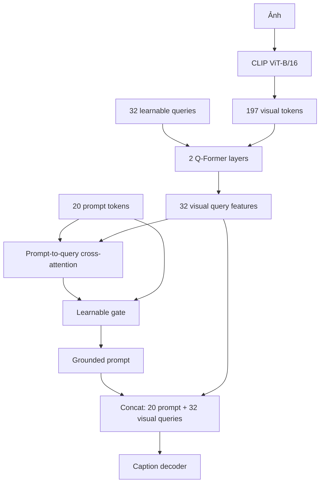

# Lightweight Q-Former: learnable visual queries

## Mục tiêu

Thí nghiệm thay 197 visual tokens trong decoder memory bằng 32 visual query tokens có
thể học. Đây là module PyTorch train từ đầu, lấy cảm hứng từ Q-Former; không tải
Q-Former hoặc weights BLIP-2 bên ngoài.



Mỗi Q-Former layer gồm query self-attention, query-to-visual cross-attention và FFN.
Mô hình dùng caption cross-entropy như Gate baseline. Không dùng YOLO, bbox hoặc
object-region loss trong ablation đầu tiên.

## Cell Kaggle đầy đủ

Chạy `SMOKE=True` trước. Nếu 20 batch hoàn thành, đổi thành `False` và Save Version
để train 10 epoch rồi đánh giá toàn bộ validation 5.000 ảnh. Chưa chạy test ở bước
chọn kiến trúc.

```python
import json
import os
import subprocess
import sys
from pathlib import Path

import torch

REPO = Path('/kaggle/working/Image_Captioning')
COMMIT = '640277e'

COCO_JSON = Path('/kaggle/input/datasets/vuthetam/mscoco-2014/dataset_coco.json')
COCO_IMAGES = Path('/kaggle/input/datasets/vuthetam/mscoco-2014/images')
PROMPT_CACHE = Path('/kaggle/input/datasets/ducanh2403/prompt-cache/prompt_clip_tokens_cache.pt')
VISUAL_CACHE = Path('/kaggle/input/datasets/ducanh2403/visual-cache')

SMOKE = True  # Thành công 20 batch thì đổi thành False.
EPOCHS = 1 if SMOKE else 10
EXPERIMENT = ('qformer_32q_2l_gated_smoke' if SMOKE else 'qformer_32q_2l_gated')


def run(args):
    args = list(map(str, args))
    print('\nRunning:', ' '.join(args), flush=True)
    subprocess.run(args, check=True)


# 1. Kiểm tra hai GPU và Input.
print('PyTorch:', torch.__version__)
print('CUDA devices:', torch.cuda.device_count())
for index in range(torch.cuda.device_count()):
    print(f'GPU {index}:', torch.cuda.get_device_name(index))
assert torch.cuda.device_count() == 2, 'Notebook phải chọn GPU T4 x2.'

for path in (COCO_JSON, PROMPT_CACHE):
    assert path.is_file(), f'Thiếu Input: {path}'
assert COCO_IMAGES.is_dir(), f'Sai thư mục ảnh: {COCO_IMAGES}'
for part in range(1, 4):
    shard = VISUAL_CACHE / f'visual_part_{part:02d}_of_03.h5'
    assert shard.is_file(), f'Thiếu visual cache: {shard}'


# 2. Clone đúng phiên bản Q-Former.
if not REPO.exists():
    run([
        'git', 'clone',
        'https://github.com/Supzxjee/Image_Captioning.git',
        REPO,
    ])
os.chdir(REPO)
run(['git', 'fetch', 'origin'])
run(['git', 'checkout', '--detach', COMMIT])
run(['git', 'rev-parse', '--short', 'HEAD'])
run([sys.executable, '-m', 'pip', 'install', '-q', '-r', 'requirements.txt'])


# 3. Tham số chung cho train và validation.
common = [
    '--dataset-json-path', COCO_JSON,
    '--base-path', COCO_IMAGES,
    '--prompt-cache-path', PROMPT_CACHE,
    '--visual-cache', VISUAL_CACHE,
    '--visual-cache-id-key', 'coco_id',
    '--visual-preprocessing', 'bilinear',
    '--visual-precision', 'fp32',
    '--visual-adapter', 'qformer',
    '--num-visual-queries', '32',
    '--qformer-layers', '2',
    '--experiment-name', EXPERIMENT,
]

train_args = [
    'train_h1_2_gated.py',
    '--mode', 'train',
    '--epochs', EPOCHS,
    '--seed', '42',
    '--batch-size', '32',
    '--num-workers', '0',
] + common

if SMOKE:
    train_args += ['--max-train-batches', '20']


# 4. Train với global batch 32 = 16 ảnh/GPU.
run([
    sys.executable, '-m', 'accelerate.commands.launch',
    '--multi_gpu',
    '--num_processes', '2',
    '--num_machines', '1',
    '--mixed_precision', 'no',
    '--dynamo_backend', 'no',
    '--num_cpu_threads_per_process', '1',
] + train_args)


# 5. Kiểm tra checkpoint và metadata kiến trúc.
experiment_dir = Path('/kaggle/working') / EXPERIMENT
history_path = experiment_dir / 'train_history_h1_2.json'
checkpoint = experiment_dir / f'checkpoints/model_h1_2_crossattn_epoch_{EPOCHS}.pth'
assert history_path.is_file(), history_path
assert checkpoint.is_file(), checkpoint

history = json.loads(history_path.read_text(encoding='utf-8'))
metadata = torch.load(checkpoint, map_location='cpu', weights_only=False)
assert metadata['visual_adapter'] == 'qformer'
assert metadata['num_visual_queries'] == 32
assert metadata['qformer_layers'] == 2
assert float(metadata['alignment_weight']) == 0.0
assert metadata['max_train_batches'] == (20 if SMOKE else 0)
print('\nHistory:', json.dumps(history, indent=2))
print('Checkpoint architecture: qformer | queries=32 | layers=2 | region loss=0')
del metadata


# 6. Bản full đánh giá validation 5.000 ảnh, chưa đánh giá test.
if not SMOKE:
    run([
        sys.executable, '-u', 'train_h1_2_gated.py',
        '--mode', 'evaluate',
        '--checkpoint', checkpoint,
        '--split', 'val',
        '--limit', '0',
        '--batch-size', '32',
        '--num-workers', '0',
    ] + common)

    metrics_path = experiment_dir / 'evaluation/val_5000_metrics_h1_2_gated.json'
    predictions_path = experiment_dir / 'evaluation/val_5000_captions_h1_2_gated.json'
    assert metrics_path.is_file(), metrics_path
    assert predictions_path.is_file(), predictions_path
    predictions = json.loads(predictions_path.read_text(encoding='utf-8'))
    assert len(predictions) == 5000
    print('\nQ-Former validation metrics:')
    print(metrics_path.read_text(encoding='utf-8'))

print('\nHoàn tất:', experiment_dir)
```

## Điều kiện đánh giá

So sánh validation Q-Former với validation Gate bằng cùng seed, prompt cache, visual
cache, 10 epoch và beam size 5. Không đưa metric Q-Former vào bảng test trước khi
chốt kiến trúc trên validation. Nếu Q-Former không vượt Gate, giữ kết quả như ablation
về cơ chế nén visual memory và không tiếp tục thêm object consistency vào nhánh này.
