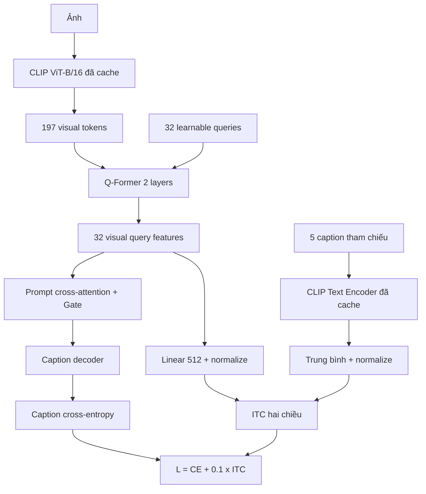

# Q-Former + Image–Text Contrastive Alignment (ITC)

## Mục tiêu

Thí nghiệm này giữ nguyên Q-Former 32 query, Gate và caption decoder của thí
nghiệm trước. Phần mới là loss đối sánh ảnh–văn bản ở mức toàn ảnh:



Với mỗi cặp ảnh–caption, mô hình tính cosine similarity giữa caption và từng
visual query, rồi chọn query có điểm cao nhất. Các ảnh/caption khác trong global
batch 32 là negative. Loss được tính theo cả chiều ảnh sang văn bản và văn bản
sang ảnh. Năm caption gốc chỉ được dùng cho ảnh thuộc train split; cache có thể
chứa cả 123.287 ảnh nhưng loader không đọc caption của validation hoặc test khi
train.

Thí nghiệm không dùng region target và đặt `alignment_weight=0`. Như vậy kết quả
đo riêng đóng góp của ITC so với Q-Former hiện tại.

## Bước 1 — tạo caption embedding cache

Chạy cell này trong một notebook Kaggle có GPU. Sau khi hoàn tất, Save Version và
đưa file HDF5 output thành Kaggle Dataset để các lần train sau không phải chạy lại
CLIP Text Encoder. Cache khoảng 0,63 GB tensor FP16.

```python
import os
import subprocess
import sys
from pathlib import Path

import h5py

REPO = Path('/kaggle/working/Image_Captioning')
COMMIT = 'b651ccb'
COCO_JSON = Path('/kaggle/input/datasets/vuthetam/mscoco-2014/dataset_coco.json')
OUTPUT = Path('/kaggle/working/caption_clip_cache.h5')


def run(args):
    args = list(map(str, args))
    print('\nRunning:', ' '.join(args), flush=True)
    subprocess.run(args, check=True)


assert COCO_JSON.is_file(), COCO_JSON
if not REPO.exists():
    run([
        'git', 'clone',
        'https://github.com/Supzxjee/Image_Captioning.git',
        REPO,
    ])
os.chdir(REPO)
run(['git', 'fetch', 'origin'])
run(['git', 'checkout', '--detach', COMMIT])
run([sys.executable, '-m', 'pip', 'install', '-q', '-r', 'requirements.txt'])

if not OUTPUT.exists():
    run([
        sys.executable, '-u', 'cache_caption_embeddings.py',
        '--dataset-json-path', COCO_JSON,
        '--output', OUTPUT,
        '--batch-size', '64',
        '--device', 'cuda',
    ])
else:
    print('Dùng lại cache:', OUTPUT)

with h5py.File(OUTPUT, 'r') as handle:
    print('Complete:', bool(handle.attrs['complete']))
    print('Features:', handle['features'].shape, handle['features'].dtype)
    print('IDs:', handle['imgids'].shape)
    assert bool(handle.attrs['complete'])
    assert handle['features'].shape == (123287, 5, 512)
    assert handle['imgids'].shape == (123287,)

print('Dung lượng:', round(OUTPUT.stat().st_size / 1e9, 3), 'GB')
print('Caption cache sẵn sàng:', OUTPUT)
```

Output cần giữ:

- `caption_clip_cache.h5`: bắt buộc.
- `caption_clip_cache.json`: metadata, nên giữ để kiểm tra nguồn dữ liệu.

## Bước 2 — smoke test rồi train đầy đủ bằng hai GPU

Thêm Dataset chứa `caption_clip_cache.h5` vào notebook train. Sửa duy nhất
`CAPTION_CACHE` nếu Kaggle gắn Dataset ở đường dẫn khác. Chạy `SMOKE=True` trước;
thành công 20 batch thì đổi thành `False` và Save Version để train 10 epoch.

```python
import json
import os
import subprocess
import sys
from pathlib import Path

import torch

REPO = Path('/kaggle/working/Image_Captioning')
COMMIT = 'b651ccb'

COCO_JSON = Path('/kaggle/input/datasets/vuthetam/mscoco-2014/dataset_coco.json')
COCO_IMAGES = Path('/kaggle/input/datasets/vuthetam/mscoco-2014/images')
PROMPT_CACHE = Path('/kaggle/input/datasets/ducanh2403/prompt-cache/prompt_clip_tokens_cache.pt')
VISUAL_CACHE = Path('/kaggle/input/datasets/ducanh2403/visual-cache')
CAPTION_CACHE = Path('/kaggle/input/datasets/ducanh2403/caption-clip-cache/caption_clip_cache.h5')

SMOKE = True  # Thành công 20 batch thì đổi thành False.
EPOCHS = 1 if SMOKE else 10
EXPERIMENT = 'qformer_itc_a01_smoke' if SMOKE else 'qformer_itc_a01'


def run(args):
    args = list(map(str, args))
    print('\nRunning:', ' '.join(args), flush=True)
    subprocess.run(args, check=True)


# 1. Kiểm tra GPU và Input.
print('PyTorch:', torch.__version__)
print('CUDA devices:', torch.cuda.device_count())
for index in range(torch.cuda.device_count()):
    print(f'GPU {index}:', torch.cuda.get_device_name(index))
assert torch.cuda.device_count() == 2, 'Notebook phải chọn GPU T4 x2.'

for path in (COCO_JSON, PROMPT_CACHE, CAPTION_CACHE):
    assert path.is_file(), f'Thiếu Input: {path}'
assert COCO_IMAGES.is_dir(), COCO_IMAGES
for part in range(1, 4):
    shard = VISUAL_CACHE / f'visual_part_{part:02d}_of_03.h5'
    assert shard.is_file(), f'Thiếu visual cache: {shard}'


# 2. Clone đúng phiên bản code.
if not REPO.exists():
    run([
        'git', 'clone',
        'https://github.com/Supzxjee/Image_Captioning.git',
        REPO,
    ])
os.chdir(REPO)
run(['git', 'fetch', 'origin'])
run(['git', 'checkout', '--detach', COMMIT])
run(['git', 'rev-parse', '--short', 'HEAD'])
run([sys.executable, '-m', 'pip', 'install', '-q', '-r', 'requirements.txt'])


# 3. Cấu hình Q-Former + ITC. Không bật region alignment.
common = [
    '--dataset-json-path', COCO_JSON,
    '--base-path', COCO_IMAGES,
    '--prompt-cache-path', PROMPT_CACHE,
    '--visual-cache', VISUAL_CACHE,
    '--visual-cache-id-key', 'coco_id',
    '--visual-preprocessing', 'bilinear',
    '--visual-precision', 'fp32',
    '--visual-adapter', 'qformer',
    '--num-visual-queries', '32',
    '--qformer-layers', '2',
    '--caption-embedding-cache-path', CAPTION_CACHE,
    '--itc-weight', '0.1',
    '--itc-temperature', '0.07',
    '--experiment-name', EXPERIMENT,
]

train_args = [
    'train_h1_2_gated.py',
    '--mode', 'train',
    '--epochs', EPOCHS,
    '--seed', '42',
    '--batch-size', '32',
    '--num-workers', '0',
] + common
if SMOKE:
    train_args += ['--max-train-batches', '20']


# 4. Global batch 32: Accelerate chia 16 ảnh cho mỗi GPU rồi gather cho ITC.
run([
    sys.executable, '-m', 'accelerate.commands.launch',
    '--multi_gpu',
    '--num_processes', '2',
    '--num_machines', '1',
    '--mixed_precision', 'no',
    '--dynamo_backend', 'no',
    '--num_cpu_threads_per_process', '1',
] + train_args)


# 5. Kiểm tra checkpoint và metadata.
experiment_dir = Path('/kaggle/working') / EXPERIMENT
history_path = experiment_dir / 'train_history_h1_2.json'
checkpoint = experiment_dir / f'checkpoints/model_h1_2_crossattn_epoch_{EPOCHS}.pth'
assert history_path.is_file(), history_path
assert checkpoint.is_file(), checkpoint

history = json.loads(history_path.read_text(encoding='utf-8'))
metadata = torch.load(checkpoint, map_location='cpu', weights_only=False)
assert metadata['visual_adapter'] == 'qformer'
assert metadata['num_visual_queries'] == 32
assert metadata['qformer_layers'] == 2
assert float(metadata['itc_weight']) == 0.1
assert float(metadata['itc_temperature']) == 0.07
assert float(metadata['alignment_weight']) == 0.0
assert metadata['max_train_batches'] == (20 if SMOKE else 0)
print('\nHistory:', json.dumps(history, indent=2))
print('Checkpoint: Q-Former 32q/2l | ITC alpha=0.1 | region loss=0')
del metadata


# 6. Bản full chỉ đánh giá validation để chọn mô hình.
if not SMOKE:
    run([
        sys.executable, '-u', 'train_h1_2_gated.py',
        '--mode', 'evaluate',
        '--checkpoint', checkpoint,
        '--split', 'val',
        '--limit', '0',
        '--batch-size', '32',
        '--num-workers', '0',
    ] + common)

    metrics_path = experiment_dir / 'evaluation/val_5000_metrics_h1_2_gated.json'
    predictions_path = experiment_dir / 'evaluation/val_5000_captions_h1_2_gated.json'
    assert metrics_path.is_file(), metrics_path
    assert predictions_path.is_file(), predictions_path
    predictions = json.loads(predictions_path.read_text(encoding='utf-8'))
    assert len(predictions) == 5000
    print('\nQ-Former + ITC validation metrics:')
    print(metrics_path.read_text(encoding='utf-8'))

print('\nHoàn tất:', experiment_dir)
```

## Dấu hiệu smoke test hợp lệ

- Log phải ghi `Q-Former active` và `ITC active: weight=0.1`.
- `Caption embedding cache` phải báo đủ ít nhất 113.287 ảnh train.
- Hai tiến trình dùng global batch 32.
- `itc` phải là số hữu hạn và thay đổi sau các batch. Giá trị đầu có thể quanh
  `ln(32) = 3,47` hoặc cao hơn vì mô hình chưa học.
- Checkpoint phải có `itc_weight=0.1`, `alignment_weight=0` và
  `max_train_batches=0` ở bản full.

## Cách kết luận

So sánh validation 5.000 ảnh với Q-Former không ITC đã có:

| Mô hình | BLEU-1 | BLEU-4 | METEOR | ROUGE-L | CIDEr |
|---|---:|---:|---:|---:|---:|
| Q-Former 32q/2l | 0.7672 | 0.3703 | 0.2830 | 0.5712 | 1.1740 |
| Q-Former + ITC α=0.1 | chờ chạy | chờ chạy | chờ chạy | chờ chạy | chờ chạy |

Chỉ chạy test 5.000 ảnh sau khi Q-Former + ITC được chọn trên validation. Không
đổi seed, số epoch, cache, batch size hoặc decoding trong lần so sánh này.
