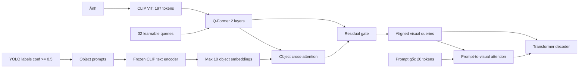

# E1: Q-Former + Object Semantic Alignment

Thí nghiệm này warm-start từ checkpoint `qformer_32q_2l_gated` tốt nhất, giữ
prompt gốc và thêm một nhánh prompt đối tượng riêng. Mỗi nhãn YOLO có confidence
`>= 0.5` được đổi thành câu `a photo of a {label}`, mã hóa bởi CLIP text encoder,
sau đó Q-Former queries truy vấn tối đa 10 object embeddings bằng cross-attention.
Kết quả được hợp nhất qua residual gate học được.



## Cell Kaggle đầy đủ

Hai full run bằng DDP đã treo lần lượt sau batch 100 và 200 dù smoke thành công.
Phiên bản này bật `find_unused_parameters`, timeout collective 10 phút và heartbeat
theo từng rank. Chạy 500 batch trên hai GPU trước; nếu hoàn thành mới chạy pilot
3 epoch. Nếu lỗi phân tán tái diễn, timeout sẽ trả traceback thay vì treo nhiều giờ.

```python
import json
import os
import subprocess
import sys
from pathlib import Path

# NCCL báo lỗi bất đồng bộ sớm; mã nguồn còn đặt timeout collective 10 phút.
os.environ['NCCL_P2P_DISABLE'] = '1'
os.environ['NCCL_IB_DISABLE'] = '1'
os.environ['NCCL_DEBUG'] = 'WARN'
os.environ['TORCH_NCCL_ASYNC_ERROR_HANDLING'] = '1'
os.environ['TORCH_NCCL_HEARTBEAT_TIMEOUT_SEC'] = '600'

import torch

REPO = Path('/kaggle/working/Image_Captioning')
COMMIT = '0c74ee8'

COCO_JSON = Path('/kaggle/input/datasets/vuthetam/mscoco-2014/dataset_coco.json')
COCO_IMAGES = Path('/kaggle/input/datasets/vuthetam/mscoco-2014/images')
PROMPT_CACHE = Path('/kaggle/input/datasets/ducanh2403/prompt-cache/prompt_clip_tokens_cache.pt')
VISUAL_CACHE = Path('/kaggle/input/datasets/ducanh2403/visual-cache')
DETECTIONS = Path('/kaggle/input/datasets/ducanh2403/objectdetectionecache/objectdetectioncache.json')
OBJECT_CACHE = Path('/kaggle/working/object_semantic_cache/object_concepts.pt')

# Bắt buộc chạy diagnostic_dual trước khi đổi sang pilot_dual.
RUN_MODE = 'diagnostic_dual'
assert RUN_MODE in {'diagnostic_dual', 'pilot_dual'}
MAX_TRAIN_BATCHES = {'diagnostic_dual': 500, 'pilot_dual': 0}[RUN_MODE]
EPOCHS = 3 if RUN_MODE == 'pilot_dual' else 1
EXPERIMENT = {
    'diagnostic_dual': 'qformer_object_alignment_dual_gpu_diagnostic_500',
    'pilot_dual': 'qformer_object_alignment_32q_2l_dual_gpu_3ep',
}[RUN_MODE]


def run(args, cwd=None):
    args = list(map(str, args))
    print('\nRunning:', ' '.join(args), flush=True)
    subprocess.run(args, cwd=cwd, check=True)


def find_old_qformer_checkpoint():
    matches = []
    for path in Path('/kaggle/input').rglob('model_h1_2_crossattn_epoch_10.pth'):
        if not path.is_file():
            continue
        try:
            meta = torch.load(path, map_location='cpu', weights_only=False)
        except Exception as error:
            print('Bỏ qua checkpoint không đọc được:', path, repr(error))
            continue
        signature = {
            'epoch': meta.get('epoch'),
            'visual_adapter': meta.get('visual_adapter', 'direct'),
            'queries': meta.get('num_visual_queries'),
            'layers': meta.get('qformer_layers'),
            'prompt_conditioned': bool(meta.get('prompt_conditioned_qformer', False)),
            'itc_weight': float(meta.get('itc_weight', 0.0)),
            'object_alignment': bool(meta.get('object_semantic_alignment', False)),
        }
        print(path, signature)
        if signature == {
            'epoch': 10,
            'visual_adapter': 'qformer',
            'queries': 32,
            'layers': 2,
            'prompt_conditioned': False,
            'itc_weight': 0.0,
            'object_alignment': False,
        }:
            matches.append(path)
    assert len(matches) == 1, (
        f'Cần đúng một checkpoint Q-Former cũ, tìm thấy {len(matches)}: {matches}')
    return matches[0]


print('PyTorch:', torch.__version__)
print('CUDA devices:', torch.cuda.device_count())
for index in range(torch.cuda.device_count()):
    print(f'GPU {index}:', torch.cuda.get_device_name(index))
assert torch.cuda.device_count() == 2, 'Notebook phải chọn GPU T4 x2.'
for path in (COCO_JSON, PROMPT_CACHE, DETECTIONS):
    assert path.is_file(), path
assert COCO_IMAGES.is_dir(), COCO_IMAGES
assert VISUAL_CACHE.is_dir(), VISUAL_CACHE
OLD_CHECKPOINT = find_old_qformer_checkpoint()
print('Warm-start checkpoint:', OLD_CHECKPOINT)

if not REPO.exists():
    run(['git', 'clone', 'https://github.com/Supzxjee/Image_Captioning.git', REPO])
run(['git', 'fetch', 'origin'], cwd=REPO)
run(['git', 'checkout', '--detach', COMMIT], cwd=REPO)
run([sys.executable, '-m', 'pip', 'install', '-q', '-r', 'requirements.txt'], cwd=REPO)

# Cache chỉ chứa object prompts, không chứa caption reference.
if not OBJECT_CACHE.is_file():
    run([
        sys.executable, '-u', 'build_object_concept_cache.py',
        '--source', DETECTIONS,
        '--dataset-json-path', COCO_JSON,
        '--output', OBJECT_CACHE,
        '--objects-field', 'objects',
        '--name-key', 'label',
        '--confidence-key', 'conf',
        '--min-confidence', '0.5',
        '--max-objects', '10',
        '--batch-size', '256',
    ], cwd=REPO)

object_bundle = torch.load(OBJECT_CACHE, map_location='cpu', weights_only=False)
assert object_bundle['metadata']['count'] == 123287
assert object_bundle['metadata']['complete']
assert object_bundle['metadata']['max_objects'] == 10
print('Object cache:', json.dumps(object_bundle['metadata'], indent=2))
del object_bundle

common = [
    '--dataset-json-path', COCO_JSON,
    '--base-path', COCO_IMAGES,
    '--prompt-cache-path', PROMPT_CACHE,
    '--visual-cache', VISUAL_CACHE,
    '--visual-cache-id-key', 'coco_id',
    '--visual-preprocessing', 'bilinear',
    '--visual-precision', 'fp32',
    '--visual-adapter', 'qformer',
    '--num-visual-queries', '32',
    '--qformer-layers', '2',
    '--object-semantic-alignment',
    '--object-prompt-cache-path', OBJECT_CACHE,
    '--experiment-name', EXPERIMENT,
]

train_args = [
    'train_h1_2_gated.py',
    '--mode', 'train',
    '--checkpoint', OLD_CHECKPOINT,
    '--epochs', str(EPOCHS),
    '--seed', '42',
    '--batch-size', '32',
    '--num-workers', '0',
] + list(map(str, common))
if MAX_TRAIN_BATCHES:
    train_args += ['--max-train-batches', str(MAX_TRAIN_BATCHES)]

run([
    sys.executable, '-m', 'accelerate.commands.launch',
    '--multi_gpu',
    '--num_processes', '2',
    '--num_machines', '1',
    '--mixed_precision', 'no',
    '--dynamo_backend', 'no',
    '--num_cpu_threads_per_process', '1',
] + train_args, cwd=REPO)

experiment_dir = Path('/kaggle/working') / EXPERIMENT
checkpoint = experiment_dir / f'checkpoints/model_h1_2_crossattn_epoch_{EPOCHS}.pth'
assert checkpoint.is_file(), checkpoint
meta = torch.load(checkpoint, map_location='cpu', weights_only=False)
assert meta['visual_adapter'] == 'qformer'
assert meta['num_visual_queries'] == 32
assert meta['qformer_layers'] == 2
assert meta['object_semantic_alignment'] is True
assert meta['object_prompt_metadata']['min_confidence'] == 0.5
assert meta['max_train_batches'] == MAX_TRAIN_BATCHES
print('Checkpoint metadata PASS')
del meta

if RUN_MODE == 'pilot_dual':
    eval_args = [
        'train_h1_2_gated.py',
        '--mode', 'evaluate',
        '--checkpoint', checkpoint,
        '--split', 'val',
        '--limit', '0',
        '--epochs', str(EPOCHS),
        '--batch-size', '32',
        '--num-workers', '0',
    ] + list(map(str, common))
    run([sys.executable, '-u'] + eval_args, cwd=REPO)

    metrics_path = experiment_dir / 'evaluation/val_5000_metrics_h1_2_gated.json'
    assert metrics_path.is_file(), metrics_path
    metrics = json.loads(metrics_path.read_text(encoding='utf-8'))
    print('\nOBJECT ALIGNMENT VALIDATION METRICS')
    print(json.dumps(metrics, indent=2))

print('\nHoàn tất:', experiment_dir)
```

## Quy tắc quyết định

So sánh rank-0 validation với Q-Former cũ: BLEU-4 `0.370322`, CIDEr `1.174012`.
Chỉ kéo dài fine-tuning hoặc sinh candidates nếu pilot 3 epoch tăng CIDEr, đồng
thời BLEU-4 không giảm quá `0.003`. Nếu không đạt, giữ kết quả như ablation E1 và
chuyển sang E2: object-guided relation alignment, không chỉnh trọng số trên test.

## Kết quả E1 trên validation 5.000 ảnh

Diagnostic DDP hoàn thành đủ 500 batch với `0.314 s/batch`; checkpoint và metadata
đều PASS. Pilot sau đó fine-tune 3 epoch trên hai T4 và đánh giá toàn bộ validation.

| Mô hình | BLEU-1 | BLEU-2 | BLEU-3 | BLEU-4 | METEOR | ROUGE-L | CIDEr |
|---|---:|---:|---:|---:|---:|---:|---:|
| Q-Former 32q/2l | 0.767153 | 0.608853 | 0.474445 | 0.370322 | 0.283012 | 0.571214 | 1.174012 |
| + Object Semantic Alignment, 3 epoch | **0.768813** | 0.608349 | 0.472681 | 0.366658 | 0.282614 | **0.572399** | 1.168861 |
| Delta | +0.001660 | -0.000505 | -0.001764 | -0.003664 | -0.000398 | +0.001185 | -0.005150 |

E1 tăng nhẹ BLEU-1 và ROUGE-L nhưng làm giảm CIDEr `0.005150` và BLEU-4
`0.003664`. Kết quả không đạt quy tắc quyết định: CIDEr không tăng và mức giảm
BLEU-4 lớn hơn `0.003`. Vì vậy không train thêm, không chọn checkpoint bằng test
và không đưa E1 vào pipeline cuối. Kết quả được giữ như một ablation cho thấy
object-label prompts đơn lẻ còn trùng lặp với bằng chứng mà Q-Former đã lấy từ
CLIP visual tokens. Bước tiếp theo là E2, dùng object làm điều kiện để chọn và căn
chỉnh relation prompts thay vì tiếp tục tăng cường object semantics độc lập.
