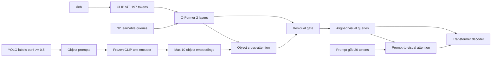

# E1: Q-Former + Object Semantic Alignment

Thí nghiệm này warm-start từ checkpoint `qformer_32q_2l_gated` tốt nhất, giữ
prompt gốc và thêm một nhánh prompt đối tượng riêng. Mỗi nhãn YOLO có confidence
`>= 0.5` được đổi thành câu `a photo of a {label}`, mã hóa bởi CLIP text encoder,
sau đó Q-Former queries truy vấn tối đa 10 object embeddings bằng cross-attention.
Kết quả được hợp nhất qua residual gate học được.



## Cell Kaggle đầy đủ

Hai full run bằng DDP đã treo lần lượt sau batch 100 và 200 dù smoke thành công.
Vì vậy workflow ổn định dùng một GPU, loại bỏ hoàn toàn NCCL/DDP. Mô hình được
warm-start từ Q-Former đã train 10 epoch nên E1 trước hết chỉ fine-tune 3 epoch,
sau đó đánh giá validation. Không tốn 10 epoch cho một hướng chưa được xác nhận.

```python
import json
import os
import subprocess
import sys
from pathlib import Path

import torch

REPO = Path('/kaggle/working/Image_Captioning')
COMMIT = '48e4667'

COCO_JSON = Path('/kaggle/input/datasets/vuthetam/mscoco-2014/dataset_coco.json')
COCO_IMAGES = Path('/kaggle/input/datasets/vuthetam/mscoco-2014/images')
PROMPT_CACHE = Path('/kaggle/input/datasets/ducanh2403/prompt-cache/prompt_clip_tokens_cache.pt')
VISUAL_CACHE = Path('/kaggle/input/datasets/ducanh2403/visual-cache')
DETECTIONS = Path('/kaggle/input/datasets/ducanh2403/objectdetectionecache/objectdetectioncache.json')
OBJECT_CACHE = Path('/kaggle/working/object_semantic_cache/object_concepts.pt')

# 'diagnostic_single': 150 batch để kiểm tra VRAM; 'pilot_single': 3 epoch + val.
# Smoke dual-GPU đã PASS nên có thể chạy thẳng pilot_single; OOM nếu có sẽ xuất
# hiện ngay batch đầu, không làm mất nhiều giờ.
RUN_MODE = 'pilot_single'
assert RUN_MODE in {'diagnostic_single', 'pilot_single'}
MAX_TRAIN_BATCHES = {'diagnostic_single': 150, 'pilot_single': 0}[RUN_MODE]
EPOCHS = 3 if RUN_MODE == 'pilot_single' else 1
EXPERIMENT = {
    'diagnostic_single': 'qformer_object_alignment_single_gpu_diagnostic_150',
    'pilot_single': 'qformer_object_alignment_32q_2l_single_gpu_3ep',
}[RUN_MODE]


def run(args, cwd=None, env=None):
    args = list(map(str, args))
    print('\nRunning:', ' '.join(args), flush=True)
    subprocess.run(args, cwd=cwd, env=env, check=True)


def find_old_qformer_checkpoint():
    matches = []
    for path in Path('/kaggle/input').rglob('model_h1_2_crossattn_epoch_10.pth'):
        if not path.is_file():
            continue
        try:
            meta = torch.load(path, map_location='cpu', weights_only=False)
        except Exception as error:
            print('Bỏ qua checkpoint không đọc được:', path, repr(error))
            continue
        signature = {
            'epoch': meta.get('epoch'),
            'visual_adapter': meta.get('visual_adapter', 'direct'),
            'queries': meta.get('num_visual_queries'),
            'layers': meta.get('qformer_layers'),
            'prompt_conditioned': bool(meta.get('prompt_conditioned_qformer', False)),
            'itc_weight': float(meta.get('itc_weight', 0.0)),
            'object_alignment': bool(meta.get('object_semantic_alignment', False)),
        }
        print(path, signature)
        if signature == {
            'epoch': 10,
            'visual_adapter': 'qformer',
            'queries': 32,
            'layers': 2,
            'prompt_conditioned': False,
            'itc_weight': 0.0,
            'object_alignment': False,
        }:
            matches.append(path)
    assert len(matches) == 1, (
        f'Cần đúng một checkpoint Q-Former cũ, tìm thấy {len(matches)}: {matches}')
    return matches[0]


print('PyTorch:', torch.__version__)
print('CUDA devices:', torch.cuda.device_count())
for index in range(torch.cuda.device_count()):
    print(f'GPU {index}:', torch.cuda.get_device_name(index))
assert torch.cuda.device_count() >= 1, 'Notebook phải bật GPU.'
for path in (COCO_JSON, PROMPT_CACHE, DETECTIONS):
    assert path.is_file(), path
assert COCO_IMAGES.is_dir(), COCO_IMAGES
assert VISUAL_CACHE.is_dir(), VISUAL_CACHE
OLD_CHECKPOINT = find_old_qformer_checkpoint()
print('Warm-start checkpoint:', OLD_CHECKPOINT)

if not REPO.exists():
    run(['git', 'clone', 'https://github.com/Supzxjee/Image_Captioning.git', REPO])
run(['git', 'fetch', 'origin'], cwd=REPO)
run(['git', 'checkout', '--detach', COMMIT], cwd=REPO)
run([sys.executable, '-m', 'pip', 'install', '-q', '-r', 'requirements.txt'], cwd=REPO)

# Cache chỉ chứa object prompts, không chứa caption reference.
if not OBJECT_CACHE.is_file():
    run([
        sys.executable, '-u', 'build_object_concept_cache.py',
        '--source', DETECTIONS,
        '--dataset-json-path', COCO_JSON,
        '--output', OBJECT_CACHE,
        '--objects-field', 'objects',
        '--name-key', 'label',
        '--confidence-key', 'conf',
        '--min-confidence', '0.5',
        '--max-objects', '10',
        '--batch-size', '256',
    ], cwd=REPO)

object_bundle = torch.load(OBJECT_CACHE, map_location='cpu', weights_only=False)
assert object_bundle['metadata']['count'] == 123287
assert object_bundle['metadata']['complete']
assert object_bundle['metadata']['max_objects'] == 10
print('Object cache:', json.dumps(object_bundle['metadata'], indent=2))
del object_bundle

common = [
    '--dataset-json-path', COCO_JSON,
    '--base-path', COCO_IMAGES,
    '--prompt-cache-path', PROMPT_CACHE,
    '--visual-cache', VISUAL_CACHE,
    '--visual-cache-id-key', 'coco_id',
    '--visual-preprocessing', 'bilinear',
    '--visual-precision', 'fp32',
    '--visual-adapter', 'qformer',
    '--num-visual-queries', '32',
    '--qformer-layers', '2',
    '--object-semantic-alignment',
    '--object-prompt-cache-path', OBJECT_CACHE,
    '--experiment-name', EXPERIMENT,
]

train_args = [
    'train_h1_2_gated.py',
    '--mode', 'train',
    '--checkpoint', OLD_CHECKPOINT,
    '--epochs', str(EPOCHS),
    '--seed', '42',
    '--batch-size', '32',
    '--num-workers', '0',
] + list(map(str, common))
if MAX_TRAIN_BATCHES:
    train_args += ['--max-train-batches', str(MAX_TRAIN_BATCHES)]

# Chỉ cho tiến trình train nhìn thấy GPU 0. Chạy Python trực tiếp nên không tạo
# process group NCCL và không thể lặp lại deadlock của hai full run trước.
single_gpu_env = os.environ.copy()
single_gpu_env['CUDA_VISIBLE_DEVICES'] = '0'
run([sys.executable, '-u'] + train_args, cwd=REPO, env=single_gpu_env)

experiment_dir = Path('/kaggle/working') / EXPERIMENT
checkpoint = experiment_dir / f'checkpoints/model_h1_2_crossattn_epoch_{EPOCHS}.pth'
assert checkpoint.is_file(), checkpoint
meta = torch.load(checkpoint, map_location='cpu', weights_only=False)
assert meta['visual_adapter'] == 'qformer'
assert meta['num_visual_queries'] == 32
assert meta['qformer_layers'] == 2
assert meta['object_semantic_alignment'] is True
assert meta['object_prompt_metadata']['min_confidence'] == 0.5
assert meta['max_train_batches'] == MAX_TRAIN_BATCHES
print('Checkpoint metadata PASS')
del meta

if RUN_MODE == 'pilot_single':
    eval_args = [
        'train_h1_2_gated.py',
        '--mode', 'evaluate',
        '--checkpoint', checkpoint,
        '--split', 'val',
        '--limit', '0',
        '--epochs', str(EPOCHS),
        '--batch-size', '32',
        '--num-workers', '0',
    ] + list(map(str, common))
    run([sys.executable, '-u'] + eval_args, cwd=REPO, env=single_gpu_env)

    metrics_path = experiment_dir / 'evaluation/val_5000_metrics_h1_2_gated.json'
    assert metrics_path.is_file(), metrics_path
    metrics = json.loads(metrics_path.read_text(encoding='utf-8'))
    print('\nOBJECT ALIGNMENT VALIDATION METRICS')
    print(json.dumps(metrics, indent=2))

print('\nHoàn tất:', experiment_dir)
```

## Quy tắc quyết định

So sánh rank-0 validation với Q-Former cũ: BLEU-4 `0.370322`, CIDEr `1.174012`.
Chỉ kéo dài fine-tuning hoặc sinh candidates nếu pilot 3 epoch tăng CIDEr, đồng
thời BLEU-4 không giảm quá `0.003`. Nếu không đạt, giữ kết quả như ablation E1 và
chuyển sang E2: object-guided relation alignment, không chỉnh trọng số trên test.
